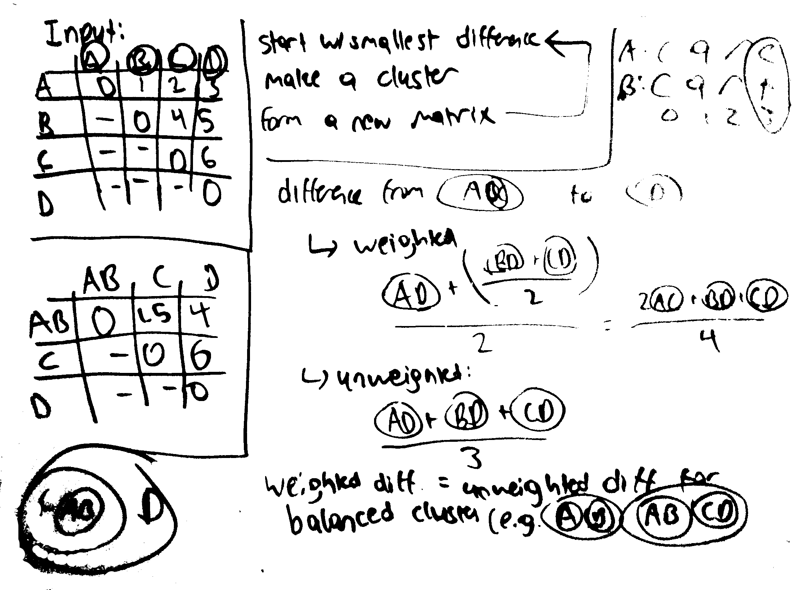

# Introduction

<a href="http://www.youtube.com/watch?feature=player_embedded&v=YOUTUBE_VIDEO_ID_HERE
" target="_blank"></a>

This program uses the UPGMA method for building phylogenetic trees, based on given differences between organisms

# File Format
```
Langur Baboon Human Rat Cattle Horse
0 14 18 38 32 65
14 0 14 33 39 65
18 14 0 37 41 64
38 33 37 0 55 64
32 39 41 55 0 71
65 65 64 64 71 0
```

# Install
```git clone github.com/SRavit1/UPGMA ```

# How to Compile
```javac Main.java```

# How to Run

```java Main```
# More Info

If desired, add custom data to Input.txt (Important: Make sure to add data in exactly the specified format. Else, the program will malfunction.)

Place the names of the organisms (let's call the total n) to be compared on the first line, separated only by spaces. The next n lines should include a series of n numbers (whole or decimal) representing the differences between organisms. The remaining lines are ignored by the program, and can be used to write comments. 

In the example in the format section, the second row, second number represents that there are 14 differences between langur and baboon, and the fourth line, fifth column represents that there are 41 differences between cattle and human. Numbers will be repeated, as there are as many differences between a baboon and human as between a human and baboon.

# Whiteboard Outline

